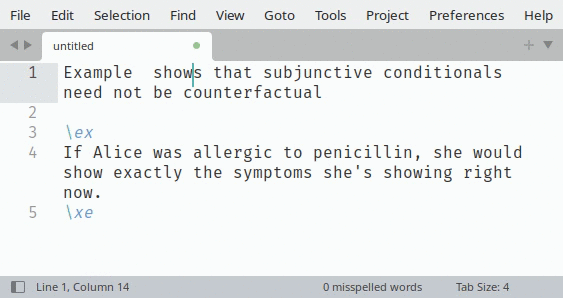

LingExRef plugin
=============================================



This Sublime Text 3 and 4 plugin allows you quickly insert references to surrounding LaTeX linguistic examples. Inspired by [quick-latex-ref](https://github.com/enricoflor/quick-latex-ref) which offers a similar functionality for Emacs.

## Usage

 Press <kbd>Ctrl</kbd> + <kbd>Alt</kbd> + <kbd>Down</kbd> to insert a reference to the next example.  Press <kbd>Ctrl</kbd> + <kbd>Alt</kbd> + <kbd>Up</kbd> to insert a reference to the previous example. 

 If the example already has a `\label{someexample}`, a reference to `\cref{someexample}` is inserted where the cursor is ; if it does not, a label is inserted right after `\ex` with name `example` and reference is inserted with name `example` and both names are then selected so you can change the name of the reference.
 
## Installation

(Instructions shamelessly adapted from [this README](https://github.com/valentinbarral/IpynbPreviewAsMarkdown/))

### Option 1: Install Using Package Control (Recommended)

1. **Install Package Control**: If you haven't already, follow the [installation instructions](https://packagecontrol.io/installation) to install Package Control.
2. **Open Command Palette**: Use `Shift+Ctrl+P` on Windows/Linux or `Cmd+Shift+P` on macOS to open the Command Palette.
3. **Install Package**: Type `Package Control: Install Package` and press Enter.
4. **Find and Install**: Search for "LingExRef" in the list, then press Enter to install it.
5. **Restart Sublime Text**: Ensure the plugin is properly loaded.

### Option 2: Manual Installation

1. **Download the Plugin**: Clone this repository or download the ZIP file and extract it.
2. **Locate Sublime Text Packages Directory**:
    - On Windows, the path is usually `C:\Users\<Your Username>\AppData\Roaming\Sublime Text 3\Packages\`
    - On macOS, the path is usually `/Users/<Your Username>/Library/Application Support/Sublime Text 3/Packages/`
    - On Linux, the path is usually `~/.config/sublime-text-3/Packages/`
3. **Install the Plugin**: Copy the plugin directory (containing `LingExRef.py` and `Default.sublime-commands` files) into the Sublime Text Packages directory.
4. **Restart Sublime Text**: This ensures the plugin is loaded and ready to use.

## Why not use `\nextx` or `\Next`?

The following works and achieves the same result after compilation, so why do we need a plugin?

```latex
Example (\nextx) shows that subjunctive conditionals need not be counterfactual

\ex
If Alice was allergic to penicillin, she would show exactly the symptoms she's showing right now.
\xe
```

Answer from [*enricoflor*](https://github.com/enricoflor/quick-latex-ref):

> this is somewhat of an antipattern: it is a convenient feature (because so often you want to refer to something close to point), but it can cause serious headaches if you happen to restructure the text where these references occur. It may be very hard to notice that the reference you intended is now different because a different \label than the one you intended to refer to intervenes between the \Next macro and the item it should refer to. The convenience provided by these macros is better delivered by your text editor (ideally, GNU Emacs).


## Configuration options

Options from `LingExRef.sublime-settings`

 - `ex_start_delimiter`: regex matching the beginning of an example ; the newly created `\label{..}` will be placed just after that point.
 - `ex_start_delimiter`: regex matching the end of an example or the beginning of a sub-example (or anything that may change what `\label{..}` will refer to). Any existing label will be looked for between `ex_start_delimiter` and `ex_stop_delimiter`. `LingExRef/LingExRef.sublime-settings` contains the regex for common packages.
 - `label_command`: LateX command to create label, place a `$` where you want the label name to be (default: `\label{$}`)
 - `ref_command`: LateX command to create a reference to a label, place a `$` where you want the reference name to be (default: `\ref{$}`)

## Limitations

  - Does not allow to cycle through next examples with repeated keystrokes

